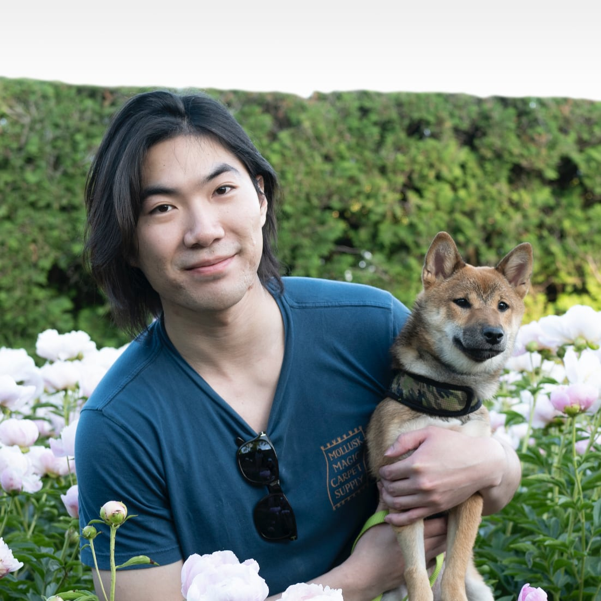

<article>

<h1 style="line-height: 0.8em;">Ruicheng Xian</h1>

<h1 style="margin-bottom: 5px; font-size: 1.5em; font-weight: 400;">冼睿成</h1>

rxian2(at)illinois.edu ⋅ [google scholar](https://scholar.google.com/citations?user=Nmk26z4AAAAJ&sortby=pubdate)

---

I received my PhD from the [University of Illinois Urbana-Champaign](http://cs.illinois.edu), where I was fortunate to be advised by [Han Zhao](http://hanzhaoml.github.io), and to have worked with [Matus Telgarsky](https://cims.nyu.edu/~matus/).  I am now at [OpenAI](https://openai.com).

My interests lie broadly in machine learning; my [thesis](assets/thesis.pdf) studied algorithmic fairness.

## Papers

[Empirical Privacy Variance](https://openreview.net/forum?id=oEvbe7vtOm)  
Yuzheng Hu, Fan Wu, Ruicheng Xian, Yuhang Liu, Lydia Zakynthinou, Pritish Kamath, Chiyuan Zhang, David Forsyth  
ICML 2025 ⋅ [pdf](https://arxiv.org/pdf/2503.12314)

[A Unified Post-Processing Framework for Group Fairness in Classification](https://arxiv.org/abs/2405.04025)  
Ruicheng Xian, Han Zhao  
[pdf](https://arxiv.org/pdf/2405.04025) ⋅ [code](https://github.com/rxian/fair-classification)

[Differentially Private Post-Processing for Fair Regression](https://proceedings.mlr.press/v235/xian24b.html)  
Ruicheng Xian, Qiaobo Li, Gautam Kamath, Han Zhao  
ICML 2024 ⋅ [pdf](https://arxiv.org/pdf/2405.04034) ⋅ [code](https://github.com/rxian/fair-regression)

[Learning List-Level Domain-Invariant Representations for Ranking](https://openreview.net/forum?id=m21rQusNgb)  
Ruicheng Xian, Honglei Zhuang, Zhen Qin, Hamed Zamani, Jing Lu, Ji Ma, Kai Hui, Han Zhao, Xuanhui Wang, Michael Bendersky  
NeurIPS 2023 spotlight ⋅ [pdf](https://arxiv.org/pdf/2212.10764.pdf) ⋅ [code](https://openreview.net/attachment?id=m21rQusNgb&name=supplementary_material)

[Revisiting Scalarization in Multi-Task Learning: A Theoretical Perspective](https://openreview.net/forum?id=6EqUpqMnwl)  
Yuzheng Hu, Ruicheng Xian, Qilong Wu, Qiuling Fan, Lang Yin, Han Zhao  
NeurIPS 2023 ⋅ [pdf](https://arxiv.org/pdf/2308.13985.pdf)

[Fair and Optimal Classification via Post-Processing](https://proceedings.mlr.press/v202/xian23b.html)  
Ruicheng Xian, Lang Yin, Han Zhao  
ICML 2023 ⋅ [pdf](https://arxiv.org/pdf/2211.01528.pdf) ⋅ [code](https://github.com/rxian/fair-classification)

[Cross-Lingual Transfer with Class-Weighted Language-Invariant Representations](https://openreview.net/forum?id=k7-s5HSSPE5)  
Ruicheng Xian, Heng Ji, Han Zhao  
ICLR 2022 ⋅ [pdf](assets/xian2022crosslingual.pdf) ⋅ [code](https://github.com/rxian/domain-alignment)

[Neural tangent kernels, transportation mappings, and universal approximation](https://openreview.net/forum?id=HklQYxBKwS)  
Ziwei Ji, Matus Telgarsky, Ruicheng Xian  
ICLR 2020 ⋅ [pdf](https://arxiv.org/pdf/1910.06956.pdf)

I like to [draw](https://ruicheng-draws.notion.site/go-draw), am a heavy coffee [drinker](assets/coffee-setup-cc.jpeg)/[enjoyer](assets/coffee-peanuts.jpeg), and my go-to for lunch is [Cantonese-style](assets/royal-bbq-champaign.jpeg) [BBQ](assets/yummy-bbq-kitchen-sf.jpeg).

</article>

<!-- 
<footer>

October 2022

</footer>
-->
