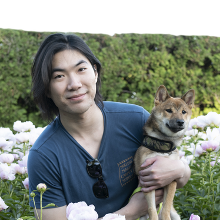

# Ruicheng Xian

rxian2(at)illinois.edu • [Google Scholar](https://scholar.google.com/citations?user=Nmk26z4AAAAJ)

---

I am a third-year CS PhD student at [UIUC](http://cs.illinois.edu), where I had the fortune to work with the glorious [Matus Telgarsky](http://mjt.web.engr.illinois.edu). I am advised by [Han Zhao](http://hanzhaoml.github.io). Previously, I graduated from [ECE](http://ece.illinois.edu) with a BS degree.

My interests lie broadly in machine learning, natural language processing, and transfer learning. I currently study cross-lingual NLP.
